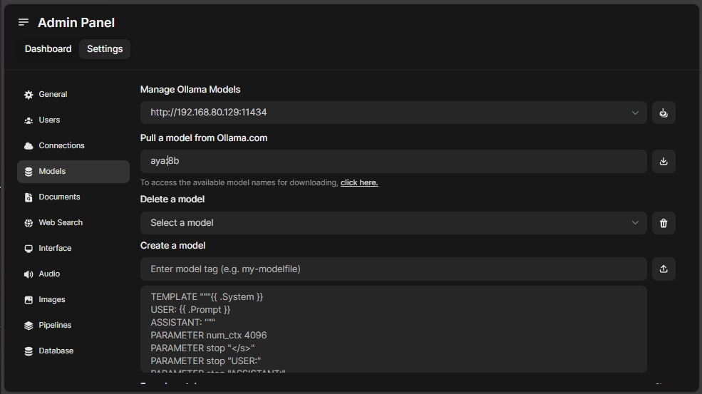

# HALp - The Happy Application Land, Personal
The Happy Application Land, Personal (HALp) is crafted similarly to a HAL system, but tailored for individual computers or as a single server on a small, closed network. It’s ideal for single or multiple analysts who need a quick and easy way to access tools and resources. HALp is designed to be a one-stop-shop for a bunch of your needs, from documentation to task management, and everything in between.

Updating may be a challenge if the system is offline. So it is recommended to have a backup of any data and running the script on a new system if you want to update. Followed by transfering the data over afterwards.

## Template to add your own tool(s)
```bash
create_new_tool() {
   set_color && echo
   echo -e "\t\tCreating MyNewTool"
   docker run -d --name NewTool --hostname newtool \
      --restart ${DOCKERSTART} --network ${HALPNETWORK} --network ${HALPNETWORK}_DB \
      -e DOCKER_ENV=True \
      -v "${DOCPATH}"/new_data:/config \
      dockerimage/image:latest  #  > /dev/null 2>&1
}
create_new_tool
```


## **Usage**
### Docker RUN
You are not required to do the pre-requisites, but it is recommended specifically for docker install if you do not have it yet. Shouldn't hurt to say yes if you want to be sure. If it asks you to overwite anything, you can skip it.

```bash
git clone https://github.com/Jonesckevin/HALP.git

cd HALP

sudo /bin/bash ./Setup.sh
```

You can view a shorter docker ps with:
```bash
dockerps --format "table \t{{.Names}}\t{{.Status}}\t{{.Ports}}"
```

### Docker Compose
```bash
git clone https://github.com/Jonesckevin/HALP.git
cd HALP
vi .env
docker-compose up -d
```

## **Tools**

|| **Tool**            | **Description**                       | **Port** |
|-|-----------------|-----------------------------------|:------:|
|  | **Homer** | Dashboard | 80 |
|  | **VaultWarden**     | Password Manager                  | 1000 |
|  | **Portainer**       | Container Management              | 1001 |
|  | **Planka**          | Task Management Kanban Board      | 1002 |
|  | **DFIR-Iris**       | Forensics Case Management         | 1003 |
|  | **BookStack**       | Wiki/Documentation                | 1004 |
|  | **Paperless-ng**    | Document Management               | 1005 |
|  | **Ollama / Web-UI** | Offline AI Chatbot                | 1006 |
|  | **Ollama / Web-UI** | Offline OCR                       | 1007 |
|  | **Draw.io**         | Diagram Editor                    | 1008 |
|  | **CyberChef**       | Cyber Operations                  | 1009 |
|  | **Regex101**        | Regular Expressions               | 1010 |
|  | **IT-tools**        | Various IT Tools in a WebUI       | 1011 |
|  | **CodiMD**          | Collaborative Markdown Editor     | 1012 |
|  | **Etherpad**        | Collaborative Text Editor         | 1013 |
|  | **n8n**             | Workflow Automation               | 1014 |
|  | **SiftNux Linux 20.04** | Forensics SSH | 33 |


## **Things you should do after running the script:**
1. Navigate to your Dashboard and check each page for functionality
2. Create Users/Passwords for each tool that doesn't get one by default. I reccomend using the included VaultWarden for password management. You'll forget...
   - **Portainer** - Navigate to URL: `http://<IP>:1001` and signup
   - **Paperless** - On the Host run the command: `docker exec -it Paperless-NGX "./manage.py createsuperuser"`
   - **GitLab** - On the Host run the command: `docker exec -it GitLab gitlab-rake "gitlab:password:reset[root]"`
   - **N8N** - Navigate to URL: `http://<IP>:1006`
   - **Ollama LLM** - Navigate to URL: `http://<IP>:1007` and signup
3. Check if N8N is running. If not you may need to run `sudo chmod -R 777 /zocker-data/n8n` because the redis needs permissions. You can be more selective with the permissions if you want.
4. Once signed up with Ollama LLM, you can go into the Admin Panel and Add the `aya:8b` model so that the OCR will work out of the box and any other models you want to use. I reccomend `llama3.2`
5.  Download the Browser Extensions for VaultWarden
    -  **Chrome:** `chrome.google.com/webstore/detail/bitwarden-free-password-m/nngceckbapebfimnlniiiahkandclblb`
    -  **Edge:** `microsoftedge.microsoft.com/addons/detail/bitwarden-password-manage/jbkfoedolllekgbhcbcoahefnbanhhlh`
    -  **Mozilla:** `addons.mozilla.org/en-US/firefox/addon/bitwarden-password-manager/`

## **Screenshots:**



